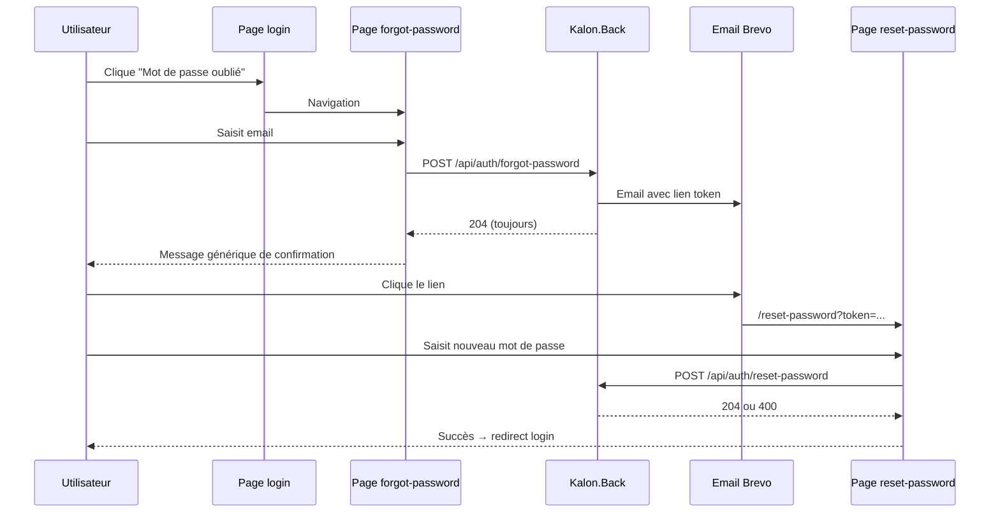

# Intégration front — Mot de passe oublié & réinitialisation

Spec pour brancher l’écran de connexion Kalon (Angular) sur les endpoints auth du backend.

---

## Vue d’ensemble



---

## Routes Angular à créer

| Route | Composant suggéré | Accès |
|-------|-------------------|-------|
| `/login` | `LoginComponent` | public (existant) |
| `/forgot-password` | `ForgotPasswordComponent` | public |
| `/reset-password` | `ResetPasswordComponent` | public |

Le lien dans l’email pointe vers :

- **Dev** : `http://localhost:4300/reset-password?token=...`
- **Prod** : `https://app.kalon-app.fr/reset-password?token=...`

> Le paramètre query s’appelle **`token`**. Le lire au `ngOnInit` via `ActivatedRoute.snapshot.queryParamMap.get('token')`.

---

## Endpoints API

Base URL : celle déjà utilisée par le front (ex. `https://api.kalon-app.fr`).

Tous ces endpoints sont **publics** : pas de header `Authorization`.

### 1. Demande de réinitialisation

```
POST /api/auth/forgot-password
Content-Type: application/json
```

**Body**
```json
{
  "email": "marie@asso.fr"
}
```

**Réponses**

| Status | Corps | Action front |
|--------|-------|--------------|
| `204` | (vide) | Afficher message de succès générique |
| `400` | `{ "message": "Email is required." }` | Erreur validation formulaire |

**Important sécurité** : le backend renvoie **toujours 204** si l’email est valide syntaxiquement, même si le compte n’existe pas. Ne jamais afficher « cet email n’existe pas ».

**Message UX recommandé (204)** :
> Si un compte est associé à cette adresse, vous recevrez un e-mail avec un lien de réinitialisation (valable 60 minutes).

---

### 2. Réinitialisation effective

```
POST /api/auth/reset-password
Content-Type: application/json
```

**Body**
```json
{
  "token": "le-token-de-l-url",
  "newPassword": "MonNouveauMotDePasse123!"
}
```

**Réponses**

| Status | Corps | Action front |
|--------|-------|--------------|
| `204` | (vide) | Succès → redirect `/login` + toast |
| `400` | `{ "message": "Token and new password are required." }` | Validation formulaire |
| `400` | `{ "message": "Lien de réinitialisation invalide ou expiré." }` | Lien mort → proposer de refaire une demande |

**Message UX succès** :
> Votre mot de passe a été mis à jour. Vous pouvez vous connecter.

**Message UX token invalide** :
> Ce lien n’est plus valide. Demandez un nouveau lien de réinitialisation.

---

### 3. Changement de mot de passe (utilisateur connecté)

Déjà disponible côté back — utile pour l’écran paramètres compte plus tard.

```
POST /api/auth/change-password
Authorization: Bearer {jwt}
Content-Type: application/json
```

**Body**
```json
{
  "currentPassword": "ancien",
  "newPassword": "nouveau"
}
```

| Status | Message typique |
|--------|-----------------|
| `204` | Succès |
| `401` | `Mot de passe actuel incorrect.` |
| `404` | `Utilisateur introuvable.` |

---

## Types TypeScript

```typescript
export interface ApiMessageResponse {
  message: string;
  detail?: string;
}

export interface ForgotPasswordRequest {
  email: string;
}

export interface ResetPasswordRequest {
  token: string;
  newPassword: string;
}

export interface ChangePasswordRequest {
  currentPassword: string;
  newPassword: string;
}
```

> Le backend sérialise en **camelCase** (`message`, pas `Message`).

---

## Service Angular suggéré

Étendre (ou créer) un `AuthService` :

```typescript
import { HttpClient } from '@angular/common/http';
import { Injectable, inject } from '@angular/core';
import { Observable } from 'rxjs';
import { environment } from '@env/environment';

@Injectable({ providedIn: 'root' })
export class AuthService {
  private readonly http = inject(HttpClient);
  private readonly baseUrl = `${environment.apiUrl}/api/auth`;

  login(email: string, password: string): Observable<LoginResponse> {
    return this.http.post<LoginResponse>(`${this.baseUrl}/login`, { email, password });
  }

  forgotPassword(email: string): Observable<void> {
    return this.http.post<void>(`${this.baseUrl}/forgot-password`, { email });
  }

  resetPassword(token: string, newPassword: string): Observable<void> {
    return this.http.post<void>(`${this.baseUrl}/reset-password`, { token, newPassword });
  }

  changePassword(currentPassword: string, newPassword: string): Observable<void> {
    return this.http.post<void>(`${this.baseUrl}/change-password`, {
      currentPassword,
      newPassword,
    });
  }
}
```

---

## Écrans — comportement attendu

### Login (`/login`)

- Ajouter un lien discret : **« Mot de passe oublié ? »** → `routerLink="/forgot-password"`.
- Ne pas modifier le flux login existant.

### Forgot password (`/forgot-password`)

**Champs**
- Email (required, format email)

**Actions**
- Bouton « Envoyer le lien »
- Lien retour « Retour à la connexion »

**États**
- `idle` → formulaire
- `loading` → bouton désactivé + spinner
- `sent` → masquer le formulaire, afficher le message générique (même en cas d’erreur réseau, gérer à part)

**Erreurs réseau** : message générique « Impossible de contacter le serveur, réessayez plus tard. »

### Reset password (`/reset-password`)

**Au chargement**
1. Lire `token` dans l’URL.
2. Si absent → afficher erreur + lien vers `/forgot-password` (pas d’appel API).

**Champs**
- Nouveau mot de passe
- Confirmation du mot de passe (validation **côté front uniquement**)

**Validation front minimale suggérée**
- Non vide
- Confirmation identique au nouveau mot de passe
- (Optionnel) règles de complexité à définir produit — le back n’impose pas encore de longueur minimale

**Actions**
- Bouton « Réinitialiser »
- Succès → `router.navigate(['/login'])` + notification

---

## Exemple composant reset (extrait)

```typescript
import { Component, OnInit, inject } from '@angular/core';
import { FormBuilder, Validators } from '@angular/forms';
import { ActivatedRoute, Router } from '@angular/router';
import { AuthService } from '@core/services/auth.service';

@Component({
  selector: 'app-reset-password',
  templateUrl: './reset-password.component.html',
})
export class ResetPasswordComponent implements OnInit {
  private readonly fb = inject(FormBuilder);
  private readonly route = inject(ActivatedRoute);
  private readonly router = inject(Router);
  private readonly auth = inject(AuthService);

  token: string | null = null;
  errorMessage: string | null = null;
  loading = false;

  form = this.fb.nonNullable.group({
    newPassword: ['', Validators.required],
    confirmPassword: ['', Validators.required],
  });

  ngOnInit(): void {
    this.token = this.route.snapshot.queryParamMap.get('token');
  }

  submit(): void {
    if (!this.token) return;
    if (this.form.invalid) return;

    const { newPassword, confirmPassword } = this.form.getRawValue();
    if (newPassword !== confirmPassword) {
      this.errorMessage = 'Les mots de passe ne correspondent pas.';
      return;
    }

    this.loading = true;
    this.errorMessage = null;

    this.auth.resetPassword(this.token, newPassword).subscribe({
      next: () => this.router.navigate(['/login']),
      error: (err) => {
        this.loading = false;
        this.errorMessage =
          err.error?.message ?? 'Une erreur est survenue. Réessayez.';
      },
      complete: () => {
        this.loading = false;
      },
    });
  }
}
```

---

## Routing module

```typescript
{
  path: 'forgot-password',
  loadComponent: () =>
    import('./auth/forgot-password/forgot-password.component').then(m => m.ForgotPasswordComponent),
},
{
  path: 'reset-password',
  loadComponent: () =>
    import('./auth/reset-password/reset-password.component').then(m => m.ResetPasswordComponent),
},
```

Ces routes doivent être **hors guard auth** (accessibles sans JWT), comme `/login`.

---

## Intercepteur HTTP

Les appels `forgot-password` et `reset-password` ne doivent **pas** envoyer de JWT expiré qui pourrait provoquer un 401 côté middleware (selon config intercepteur).

Si l’intercepteur ajoute automatiquement `Authorization` sur toutes les requêtes, exclure explicitement :

```typescript
const publicAuthPaths = ['/api/auth/login', '/api/auth/forgot-password', '/api/auth/reset-password'];
```

---

## Checklist d’implémentation

- [ ] Lien « Mot de passe oublié » sur `/login`
- [ ] Page `/forgot-password` + appel API
- [ ] Message générique après envoi (pas de fuite email)
- [ ] Page `/reset-password` lit `?token=`
- [ ] Gestion token manquant / invalide / expiré
- [ ] Redirect login après succès reset
- [ ] Routes publiques (pas de `AuthGuard`)
- [ ] Intercepteur HTTP : pas de Bearer sur ces 2 endpoints
- [ ] Tests e2e ou unitaires sur validation confirmation mot de passe

---

## Tests manuels

1. **Happy path**
   - Login → Mot de passe oublié → email valide → 204
   - Ouvrir le lien reçu → nouveau MDP → login avec nouveau MDP

2. **Email inconnu**
   - `forgot-password` avec email inexistant → toujours 204 + même message UI

3. **Token expiré**
   - Attendre > 60 min ou réutiliser un vieux lien → 400 « Lien invalide ou expiré »

4. **Token réutilisé**
   - Réinitialiser une fois → réutiliser le même lien → 400

5. **Token manquant**
   - Aller sur `/reset-password` sans query → message + lien forgot-password

---

## Config back à aligner

Vérifier que `PasswordReset:FrontendResetUrl` en prod correspond exactement à la route Angular déployée :

```json
"PasswordReset": {
  "FrontendResetUrl": "https://app.kalon-app.fr/reset-password",
  "TokenExpirationMinutes": 60
}
```

Si le front change de path (ex. `/auth/reset-password`), mettre à jour cette config côté back.
